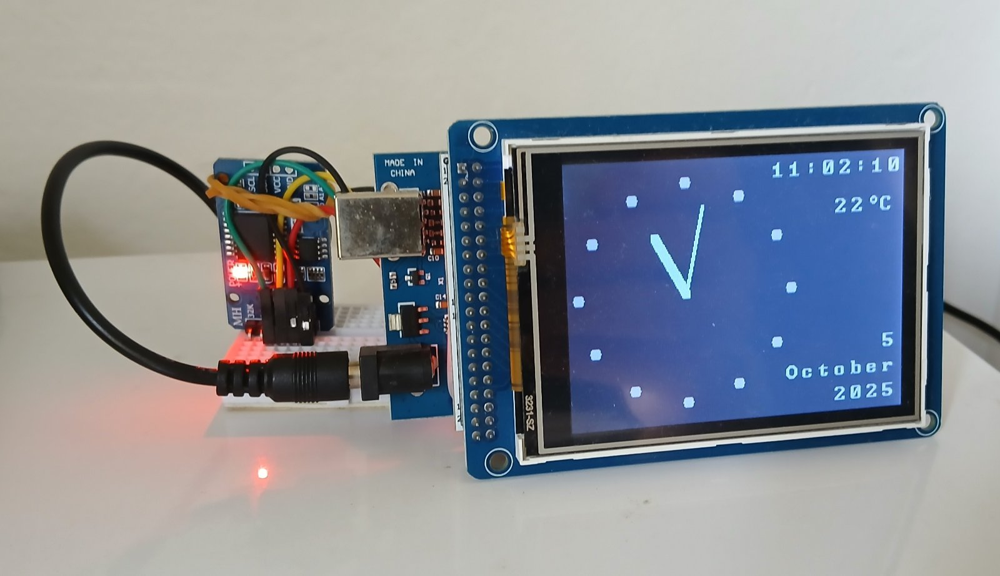

# Round Clock

## Hardware:
* Arduino Mega 2560 V3.
* TFT LCD Mega shield V2.2.
* TFT_320QVT 320x240 LCD screen which uses SSD1289 IC driver and XPT2046 touch screen controller. 
* DS3231 Realtime clock module.

I used a defective LCD with a non-functional touchscreen, so I used serial communication via UART for setting the date and time. On every startup, the clock requests the user to enter data via the serial monitor. If the user doesn't start entering data during 5 seconds, the clock finishes the booting sequence and uses the data and time currently stored in the Real-Time Clock (RTC) module.
